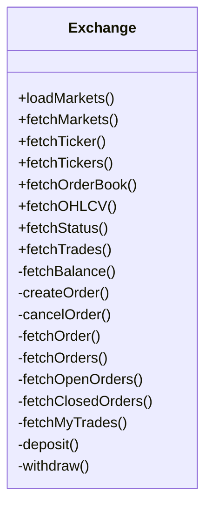

# ccxt

## Support Exchange

2022-07-20 23:19:40

ccxt支持117多家加密货币交易市场和交易API，除了市价单和限价单外，一些交易所还支持保证金交易（杠杆）、各种衍生品（如期货合约和期权），还有暗池OTC、场外交易等。

## 关键概念

### Exchanges

交换所类，所有交换所支持一组共享的通用方法。然后拥有一套公共和私有API，所有交换所类都派生自Exchange基类。

#### API接口



接下来我们看一下具体的函数功能。

#### 实例化

```javascript
const ccxt = require('ccxt')
let exchange = new ccxt.kraken()
// or
let kraken1 = new ccxt.kraken({ id: 'kraken1' })
// or
let kraken2 = new ccxt.kraken({ id: 'kraken2' })
// or
let coinbasepro = new ccxt['coinbasepro']()

// 实例化过程可以覆盖部分exchange属性
const exchange = new ccxt.binance({
    'rateLimit': 10000,
    'headers': {
        'YOUR_CUSTOM_HTTP_HEADER': 'YOUR_CUSTOM_VALUE'
    },
    'options': {
        'adjustForTimeDifference': true
    }
})
```

- id：每个交易所都有一个默认id。id 不用于任何用途，它是用于用户土地交换实例识别目的的字符串文字。您可以有多个链接到同一个交易所，并通过 id 区分它们。默认 id 都是小写的并且对应于交换名称。
- name：这是一个包含人类可读交换名称的字符串文字。
- countries: 由 2 个符号 ISO 国家代码组成的字符串数组，交换所在的位置。
- urls['api']: API 调用的单个字符串文字基本 URL 或私有和公共 API 的单独 URL 的关联数组。
- urls['www']：主要的 HTTP 网站 URL。
- urls['doc']：指向其网站上用于交换 API 的原始文档的单个字符串 URL 链接或指向文档的链接数组。
- version：包含当前交换 API 的版本标识符的字符串文字。ccxt 库会在每次请求时将此版本字符串附加到 API 基本 URL。你不必修改它，除非你正在实现一个新的交换 API。在某些情况下，版本标识符通常是一个以字母“v”开头的数字字符串，例如 v1.1。除非您正在实现自己的新加密交换类，否则不要覆盖它。
- api：一个关联数组，包含加密交换公开的所有 API 端点的定义。ccxt 使用 API 定义为每个可用端点自动构造可调用的实例方法。
- has：这是交换功能的关联数组（例如fetchTickers，fetchOHLCV或CORS）。
- timeframes：时间帧的关联数组，由交易所的 fetchOHLCV 方法支持。仅当has['fetchOHLCV']属性为 true 时才会填充。
- timeout：请求-响应往返的超时（以毫秒为单位）（默认超时为 10000 毫秒 = 10 秒）。如果在那段时间内没有收到响应，库将抛出RequestTimeout异常。您可以保留默认超时值或将其设置为合理的值。当然，永远挂起没有超时不是您的选择。在一般情况下，您不必覆盖此选项。
- rateLimit: 以毫秒为单位的请求速率限制。指定对同一交换的两个后续 HTTP 请求之间所需的最小延迟。内置速率限制器默认启用，可以通过将enableRateLimit属性设置为 false 来关闭。
- enableRateLimit：启用内置速率限制器并限制连续请求的布尔值（真/假）。此设置true默认为（启用）。用户需要实现自己的:ref:`速率限制<rate limit>`或启用内置的速率限制器以避免被交易所禁止。
- userAgent: 设置 HTTP User-Agent 标头的对象。ccxt 库将默认设置它的 User-Agent。有些交易所可能不喜欢它。如果您在从交易所获得回复时遇到困难并且想要关闭 User-Agent 或使用默认值，请将此值设置为 false、未定义或空字符串。的值userAgent可能会被headers下面的 HTTP 属性覆盖。
- headers：HTTP 标头及其值的关联数组。默认值为空{}。所有标头都将添加到所有请求之前。如果User-Agent标头设置在 内headers，它将覆盖userAgent上面属性中设置的任何值。
- verbose：一个布尔标志，指示是否将 HTTP 请求记录到标准输出（verbose 标志默认为 false）。Python 人员有另一种使用标准 pythonic 记录器进行 DEBUG 记录的方法，通过将这两行添加到代码的开头来启用该方法：
- markets：由常见交易对或交易品种索引的市场关联数组。在访问此属性之前应加载市场。在您调用交换实例上的方法之前，市场不可用。loadMarkets() / load_markets()
- symbols：交易所可用符号的非关联数组（列表），按字母顺序排序。这些是markets财产的钥匙。符号从市场加载和重新加载。此属性是所有市场键的便捷简写。
- currencies：货币的关联数组（字典），按代码（通常为 3 或 4 个字母）可用于交易所。货币从市场加载和重新加载。
- markets_by_id：由特定于交易所的 id 索引的市场关联数组。在访问此属性之前应加载市场。
- proxy : 包含 http(s) 代理的基本 URL 的字符串文字，默认为''。用于网络浏览器和来自被阻止的位置。代理字符串的一个示例是'http://cors-anywhere.herokuapp.com/'。在发送 HTTP 请求之前，绝对交换端点 URL 会附加到此字符串。
- apiKey：这是您的公共 API 密钥字符串文字。大多数交易所需要API 密钥设置。
- secret：您的私有 API 密钥字符串文字。大多数交易所也需要这个以及 apiKey。
- password：带有您的密码/短语的字符串文字。一些交易所需要此参数进行交易，但大多数交易所不需要。
- uid：您帐户的唯一 ID。这可以是字符串文字或数字。一些交易所也需要这个来进行交易，但大多数都不需要。
- requiredCredentials：一个统一的关联字典，显示向底层交换发送私有 API 调用需要上述哪些 API 凭证（交换可能需要一组特定的密钥）。
- options：特定于交易所的关联字典，包含基础交易所接受并在 CCXT 中支持的特殊键和选项。
- precisionMode：交换小数精度计数模式，阅读更多关于精度和极限

### 市场(Markets)

每个交易所都是交易某些贵重物品的地方